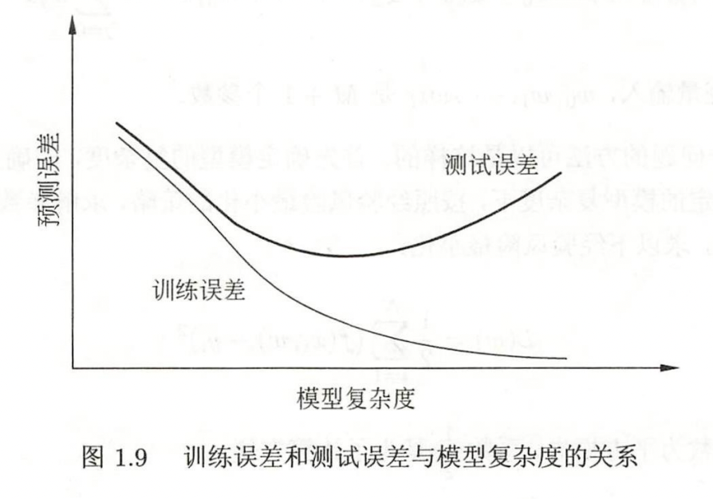

# 第一章 统计学习及监督学习的概论

## 1.1 统计学习
1. 统计学习：关于计算机基于数据构建概率统计模型并运用模型对数据进行预测与分析的一门学科。统计学习也叫机器学习。
2. 学习：指的是执行改进它性能的过程。

## 1.2 统计学习的分类
-- 图片 --
### 1.2.1 基本分类
1. 监督学习
监督学习从标注数据中学习预测模型.监督学习可以概括如下：从给定有限的训练数据出发，假设数据是独立同分布的，而且假设模型属于某个假设空间，应用某一评价准则，从假设空间中选取一个最优的模型，使得他对已给的训练数据及未知测试数据在给定评价标准意义下最准确的预测
> 监督学习的目的在于学习一个由输入到输出的映射，这一映射关系由模型来表示。换句话说，学习的目的在于找到最好的这样的模型。模型属于由输入空间到输出空间的映射的集合，这个集合就是假设空间。假设空间的确定意味着学习范围的确定
2. 无监督学习
无监督学习是指从无标注的数据中学习预测模型
3. 强化学习
> 指智能系统在于环境的连续互动中学习最优行为策略的机器学习问题。假设智能系统与环境的互动基于马尔科夫决策过程，智能系统能观测到的是与环境互动的到的数据序列。强化学习的本质是学习最优的序贯决策
4. 半监督学习
利用少量标注数据和大量未标注数据，以较低的成本达到较好的学习效果
5. 主动学习
机器不断给出实例让其进行标注，然后利用标注数据学习预测模型
### 1.2.2 按模型分类
1. 概率模型与非概率模型
2. 线性模型与非线性模型
3. 参数化模型与非参数模型
### 1.2.3 按算法分类
1. 在线学习
每次只接受一个样本，进行预测，之后学习的模型，并不断重复该操作的机器学习
> 有些学习必须是在线的，比如，数据依次到达无法存储，系统需要及时做出处理；数据规模很大，不可能一次处理所有的数据；数据模式随时间动态的变化，需要算法快速适应新的模式。但是在线学习通常比批量学习更难，很难学到预测准确率更高的模型，每次模型更新中，可利用的数据有限。
2. 批量学习
一次接受所有的数据
## 1.3 统计学习的三要素
方法=模型+策略+算法
### 1.3.1 模型
两种表达形式：决策函数和条件概率分布
### 1.3.2 策略
1. 损失函数
- 常用的主要由0-1损失函数，平方损失函数，绝对损失函数，对数损失函数
- 损失函数的期望值就是风险函数
2. 风险函数
-- csdn博客 如何全面的认识损失函数和风险函数？--
### 1.3.3 算法
指学习模型的具体计算方法。考虑用什么样的计算方法求解最优模型。
## 1.4 模型估计与模型选择
### 1.4.1 训练误差与测试误差
当损失函数给定的时候，基于损失函数的训练误差和测试误差成为了学习方法评估的标注
1. 训练误差：在训练数据集上的平均损失
2. 测试误差：在测试数据集上的平均损失
> 训练误差本质上并不重要，而测试误差反应了学习方法对未知的测试数据集合的预测能力，是学习中重要的概念。测试误差小的方法具有更好的预测能力。通常将学习方法对未知数据的预测能力成为泛化能力
### 1.4.2 过拟合与模型选择（⭐️）
过拟合：学习时所选择的模型所包含的参数过多，以至出现这一模型对已知数据预测很好，但对未知数据预测得很差的现象。
> 当假设空间含有不同复杂度（例如，不同参数的个数）的模型时。就要面临模型选择的问题。我们希望选择一个合适的模型。如果在假设空间中存在“真”模型，那么我们所选择的模型就应当逼近模型。具体的说，所选择的模型要与“真”模型的参数相同，或者说所选择的参数向量与真模型的参数向量相近。
> 如果一昧追求提高对训练数据的预测能力，所选模型的复杂程度往往会比真模型更高（这个地方的复杂程度可以暂时理解为参数更多）。这种现象称为过拟合现象。一个经典的例子就是M次多项式函数拟合问题的例子（P21-例1.1）。在这个例子中可以看到，随着多项式次数的增加训练误差会减小，直至趋于0，但是测试误差却不如此，他会随着多项式次数（模型的复杂度）的增加先减小，后增大。而最终的目的是使测试误差达到最小。

## 1.5 正则化与交叉验证
### 1.5.1 正则化
正则化是结构风险最小化策略的实现，是在经验风险上加上一个正则化项或者罚项目。正则化一般是模型复杂度的单调函数递增函数，模型越复杂，正则化值就越大。
### 1.5.2 交叉验证
如果给定的数据样本充足的情况下，进行模型的选择的一种简单方法是随机选择的将数据集切分成3部分，分别为数据集、测试集、验证集。在学习到的不同复杂度（参数个数不同）的模型中，选择对验证集有最小预测误差的模型。常用的就是简单交叉验证（70%训练，20%测试，10%验证）

## 1.6 泛化能力
模型的泛化能力是指该方法学习的到的模型对于未知数据的预测能力。而泛化的误差就是所学习得到的模型的期望风险

## 1.7 监督学习的应用
主要应用在三个方面：分类问题、标注问题、回归问题
### 1.7.1 分类的评价指标（⭐️）
|  指标   | 含义  |
|  ----  | ----  |
| TP  | 将正类预测为正类数 |
| FN  | 将正类预测为负类数 |
| FP  | 将负类预测为正类数 |
| FN  | 将负类预测为负类数 |
精确率的定义如下所示：
**P=TP/(TP+FP)**
召回率的定义如下所示：
**R=TP/(TP+FN)**
F值的定义如下所示
**F1 = 2*TP / (2*TP + FP + FN)**
