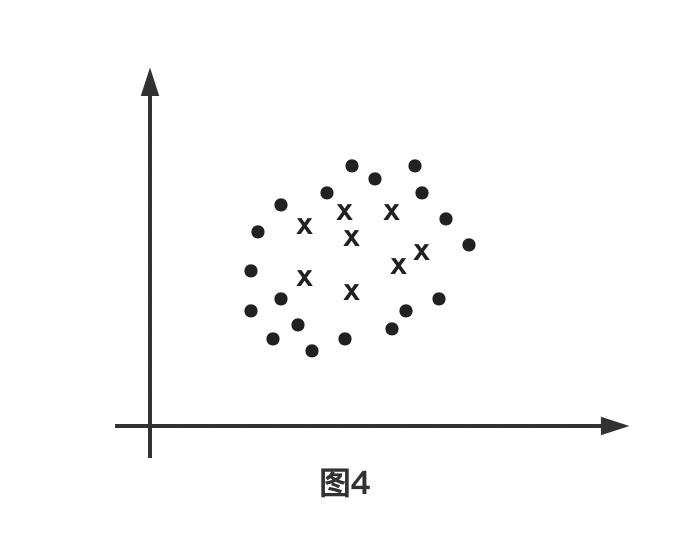
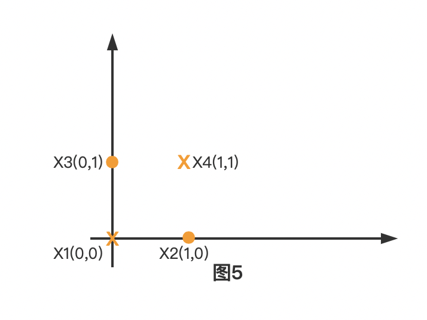

# 第七章 支持向量机

## 1 思考：在感知机中无数的解当中最佳的解是哪一个？
在感知机中，因为选取的模型参数初始值不同，以及迭代选取的变量顺序不同所以造成最后的求解超平面并不唯一，也就是结果有可能呈现出下面这样的情况：

当然肯定不止这三条线，实际上可证明在感知机中这样的线应该有无数条。但是以图中3个超平面为例，最佳的超平面是哪一条呢？事实上，很多都会选择橙色的线条，因为如果我们按照图1的红色线条来移动（发生这种情况可能是因为误差），可以发现如果是橙色的超平面，即使发生这样的移动，他们仍然能够被正确分类。

## 2.Vapnik提出的性能指标
事实上vapnik提出了基于支持向量的最大间隔，在图2中来说就是试图平移超平面，直到最先接触到样本，而最终形成了一个平行区域，而中间的平分线就是所需要的超平面。当然这样的区域也有很多，如图3所示

在这里Vapnik等人认为，当区域的间隔最大的时候，其所确定的超平面是最佳的。综上，也就是在一些限制条件下，尽可能的使得d足够的大【有点规划的味道了】。
> 位于区域边界上的样本点事实上就是支持向量，而我们超平面的确定只与支持向量有关，与其余样本没有关系，这也是为什么常说SVM在对小样本进行分类的时候非常有效。
## 3.如何将这种性能指标进行数学描述？
#### 3.1 线性可分支持向量机
给定线形可分训练数据集，通过间隔最大化得到分离超平面$$w^*x+b^*=0$$
决策函数为
$$f(x)=sign(wx+b)$$
$w$,$b$为模型的未知参数。要求解这个未知参数就是解相应的凸二次规划问题
$$min\qquad \frac{1}{2}||w||^2$$
$$std\qquad y_i(w^Tx_i+b)\ge1$$
从2的性能指标到这个二次规划问题似乎有些距离，接下来就说明推导到这个二次规划的
#### 3.2 三个事实
- **事实1**: $w^Tx+b$和$aw^Tx+ab$是同一个超平面
- **事实2**: 向量$x_0$到超平面$w^Tx+b=0$的距离公式为$$\frac{|w^Tx_0+b|}{||w||}$$
- **事实3**: 对于给定的训练数据集$T$和超平面$w^T+b=0$，定义超平面关于样本点$(x_i,y_i)$的函数间隔为$$r_i=y_i(w*x_i+b)$$

#### 3.3 二次规划的推导
在事实2的基础上，知道一点$x_0$到超平面的距离公式为$$\frac{|w^Tx_0+b|}{||w||}$$
同时根据vapnik提出的最大间隔原则，**选择距离超平面最近的一个样本$x_m$使其到超平面的距离最大**，即
$$max\qquad\frac{|w^Tx_m+b|}{||w||}$$
再由事实3，其他的样本$x_i$到超平面的函数间隔都大于$x_m$到超平面的函数间隔，即
$$y_i(w^Tx_i+b)\ge|w^Tx_m+b|$$
再根据事实3，用a去缩放【超平面不会发生改变】
$$(w,b)\Longrightarrow(aw,ab)$$
最终使在支持向量$x_m$上有$|w^Tx_m+b|=1$，这时我们的目标函数和条件就转换为了
$$max\qquad\frac{1}{||w||}$$
$$std\qquad y_i(w^Tx_i+b)\ge1$$
事实上最大化$\frac{1}{||w||}$和最小化$\frac{1}{2}||w||^2$是等价的。所以最终求的了在3.1中的规划模型，即：
$$min\qquad \frac{1}{2}||w||^2$$
$$std\qquad y_i(w^Tx_i+b)\ge1$$
#### 3.4 线性可分支持向量机学习算法——最大间隔法
> 输入：线性训练数据集
> 输出：最大间隔分离超平面和分类决策函数
1. 构造并求解约束优化问题：
$$min\qquad \frac{1}{2}||w||^2$$
$$std\qquad y_i(w^Tx_i+b)\ge1$$
并求解最优解$w^*,b^*$
2. 由此得到分离的超平面：
   $$w^* \bullet x + b^* = 0$$
   分类决策函数
   $$f(x)=sign(w^ \bullet x +b)$$
#### 3.5 支持向量和间隔边界
在线性可分的情况下，训练数据集的样本点中与分离超平面距离最近的样本点的实例称为支持向量。同时注意到，在我们的图2中，两个间隔边界是平行的，并且没有实例点落在他们的中间。分离超平面与它们平行且位于这条长带的中央。决定分离超平面时只有支持向量起作用，而其他的实例点并没有起作用。如果移动支持向量将改变所求的解；但是如果移动在间隔边界以外的其他实例点，甚至去掉这些实例点，则解是不会改变的。由于支持向量在确定分离超平面中起着决定性的作用，所以将这种分类模型称为支持向量。支持向量的个数一般很少，所以支持向量机由很少的“重要”样本确定。注意【如果数据集不可分这时候线性可分支持向量机就不再合适】

## 4.线性支持向量机
线性可分问题的支持向量机的学习方法，对于不可分训练数据集是不适用的。比如假设训练数据集不是线性可分的。通常情况下，训练数据中存在一些特异点，将这些特异点去掉后，剩下的大部分样本点组成的集合是线性可分的。如图四所示

线性不可分意味着某些样本点$(x_i,y_i)$不能满足函数间隔大于等于1的约束条件。为了解决这个问题，可以对每个样本点$(x_i,y_i)$引进一个松弛变量$\zeta_i \ge 0$，使得函数间隔加上松弛变量大于等于1.这样约束条件变为$$y_i(w\bullet x_i + b)\ge 1-\zeta_i$$。同时，对每个松弛变量$\zeta_i$,支付一个代价$\zeta_i$,这时我们的目标函数就变成了$$\frac{1}{2}||w||^2+C\sum_{i=1}^{N}\zeta_i$$
这里的$C>0$被称为惩罚参数，一般由应用问题决定，C值大时对误分类的惩罚增大，C值小时对误分类的惩罚减小。最小化目标函数包含两层含义：使$\frac{1}{2}||w||^2$尽量小即间隔尽量大，同时使得误分类的个数尽量的小，C是二者的调和系数。所以针对线性不可分的线性支持向量机的学习问题变成以下规划问题：$$ \underset {w,b,\zeta}{\min} \quad \frac{1}{2}||w||^2+C\sum_{i=1}^{N}\zeta_i$$
$$s.t. y_i(w_i\bullet x_i+b)\ge 1- \zeta_i$$
由于现实生活中训练数据集往往是不可分的，线性支持向量机具有更广阔的通用性。

## 5. SVM处理非线性
与上图不同，如果数据呈现下列情况如何来确定超平面

显然这时很难找到一个直线超平面来将我们样本分开，处理这种情况，其他很多算法比如神经网络、随机森林。它们都是通过找到一个椭圆等图形来划分此类数据集的。而vanpic等人认为仍然可以选择使用一条直线来划分数据集合，只不过是在更高维的空间中，将$$x \overset{\varphi} {\longrightarrow}\varphi(x)$$将x从低纬度转换到高维度。可以以下面的异或例子（感知机这种线性分类器是无法处理这种异或问题的）来理解。数据集呈现以下形式：

这时候无法找到一条直线能够将我们的数据集分开。但是如果这时候选取以下的映射方式来将映射二维数据
$$x_i=\begin{bmatrix} 
a \\ b
\end{bmatrix}  \overset{\varphi}{\longrightarrow} \varphi(x_i)=
\begin{bmatrix}
a^2 \\ b^2 \\ a \\ b \\ ab 
\end{bmatrix}$$
显然如果按照这种变换数据集就从二维转换到了五维。数据集中的实例如果按照这种映射就被转换成了
$$x_1=\begin{bmatrix} 
0 \\ 0
\end{bmatrix}  \overset{\varphi}{\longrightarrow} \varphi(x_1)=
\begin{bmatrix}
0 \\ 0 \\ 0 \\ 0 \\ 0 
\end{bmatrix}$$
$$x_2=\begin{bmatrix} 
1 \\ 0
\end{bmatrix}  \overset{\varphi}{\longrightarrow} \varphi(x_2)=
\begin{bmatrix}
1 \\ 0 \\ 1 \\ 0 \\ 0 
\end{bmatrix}$$
$$x_3=\begin{bmatrix} 
0 \\ 1
\end{bmatrix}  \overset{\varphi}{\longrightarrow} \varphi(x_3)=
\begin{bmatrix}
0 \\ 1 \\ 0 \\ 1 \\ 0 
\end{bmatrix}$$
$$x_4=\begin{bmatrix} 
1 \\ 1
\end{bmatrix}  \overset{\varphi}{\longrightarrow} \varphi(x_4)=
\begin{bmatrix}
1 \\ 1 \\ 1 \\ 1 \\ 1
\end{bmatrix}$$
那么此时肯定能找到$(w,b)$使得通过决策函数$f(x)=sign(w^T{\varphi}(x)+b)$能将我们的样本分开。比如
$$w=
\begin{bmatrix}
1 \\ 1 \\ 1 \\ 1 \\ -6
\end{bmatrix} 
\qquad
b=-1$$
按照超平面函数$w\bullet\varphi(x_i)+b$以及决策函数$f(x_i)=sign(w\bullet\varphi(x_i)+b)$，则
$$w\bullet\varphi(x_1)+b=-1\leq0 \longrightarrow f(x_1)=-1\longrightarrow x1为负类$$
$$w\bullet\varphi(x_2)+b=2\ge0\longrightarrow f(x_2)=1\longrightarrow x2为正类$$
$$w\bullet\varphi(x_3)+b=1\ge0\longrightarrow f(x_3)=1\longrightarrow x3为正类$$
$$w\bullet\varphi(x_4)+b=-3\leq0\longrightarrow f(x_4)=-1\longrightarrow x4为负类$$
可以从上面看出，在二维空间中无法找到一个超平面将其分类的时候，如果找到$\varphi$将实例映射到高维空间中就能够找到一个超平面将其分类，如上例所示。此时规划约束条件变为成了以下的形式【你可以回到4中查看两者的区别到底在哪里？】：
$$ \underset {w,b,\zeta}{\min} \quad \frac{1}{2}||w||^2+C\sum_{i=1}^{N}\zeta_i$$
$$s.t.1 \quad y_i(w_i\bullet \varphi(x_i)+b)\ge 1- \zeta_i$$
$$s.t.2 \quad \zeta_i\ge0$$
那这里怎么寻找合适的映射函数呢？vanpic等人在这里的想法非常具有开创性。他们提出了以下的想法
1. $\varphi$应该是无限维的；
> 如果这里是无限维，那么由$w_i\bullet \varphi(x_i)$,那么$w_i$也是无限维，这个时候情况就变得很复杂了。而vanpic等人却用了一个有限维的手段来解决了这个问题。
2. vanpic等人认为在SVM中，我们可以不知道无限维映射$\varphi(x)$的显式表达式，只需要知道一个核函数（Kernel Function）【在二维下】$$K(x_1,x_2)=\varphi (x_1) \varphi(x_2)$$那么上面优化问题仍然可解。$\varphi (x_1) \varphi(x_2)$为$\varphi (x_1)$和$\varphi (x_2)$的内积。而之所以提出这种想法是因为直接计算$K(x_1,x_2)$是比较容易的，而通过$\varphi (x_1)$和$\varphi (x_2)$计算$K(x_1,x_2)$并不容易，当然并不是所有的函数都可以拆成上式两个表达式相乘。常用的主要有以下核函数：
   *  高斯核函数$$K(x_1,x_2)=e^{-\frac{||x_1-x_2||^2}{2\sigma^2}}$$
   * 多项式核函数$$K(x_1,x_2)=(x_1^Tx_2+1)^{d}$$

所以如果我们已经知道核函数了，这时候怎么去替换优化条件中的$\varphi(x_i)$呢?接下来先了解一些优化理论。

## 5.优化理论
这里并不会详细论述优化理论的知识。只是针对svm这一部分需要用到的东西进行阐述。
#### 5.1 原问题
原问题的定义如下所示：
- 最小化：$f(w)$
- 限制条件：$$g_i(w)\leq 0 (i=1\sim K)$$
$$h_i(w)=0(i=1\sim M)$$
> 需要注意一点的是，这是一个非常通用的定义。尽管在定义中求最小化，实际上，这也是$-f(x)$的最大化。而在条件中尽管是小于等于，但是也可以是$-g(x)\ge 0$,而$h_i(w)=0$也可以将$h_i(w)$内部还减了一个常数C。所以尽管原问题的定义看起来是很唯一的，实际上却是非常通用的一个定义
#### 5.2 对偶问题

1. 定义
$$L(w,\alpha,\beta)=f(w)+\sum_{i=1}^{K}\alpha_ig_i(w)+\sum_{i=1}^{M}\beta_ih_i(w)$$
2. 对偶问题定义
$$最大化：\theta(\alpha,\beta)=\inf	\left\{ L(w,\alpha,\beta) \right\}$$
$$限制条件：\alpha_i\ge 0(i=1\sim K)$$
> 一个简单的解释，其实1的定义很显然就是一个拉格朗日条件极值。而针对2，其实就是在固定$\alpha 和\beta$下遍历所有的$w$，找到L的最小值。也就是说，$w$不再是$\theta$未知参数。
#### 5.3 原问题与对偶问题的关系
1. 定理：如果$w$是原问题的解，而$\alpha$和$\beta$是对偶问题的解，则有$$f(w)\ge\theta(\alpha,\beta)$$
> $\theta(\alpha,\beta)=inf\{L(w,\alpha,\beta)\}\leq L(w,\alpha,\beta)=f(w)+\sum_{i=1}^{K}\alpha_ig_i(w)+\sum_{i=1}^{M}\beta_ih_i(w)\leq f(w)$ 
2. 定义：原问题与对偶问题的间距G
$$G=f(w)-\theta(\alpha,\beta)\ge 0$$
3. 强对偶定理
若$f(w)$为凸函数，且$g(w)=Aw+b$以及$h(w)=Cw+d$，那么此优化的原问题与对偶问题的间距为0，即G=0$$f(w)=\theta(\alpha,\beta)$$
试想如果这个时候该等式成立，那么观察下列关系
> $\theta(\alpha,\beta)=inf\{L(w,\alpha,\beta)\}\leq L(w,\alpha,\beta)=f(w)+\sum_{i=1}^{K}\alpha_ig_i(w)+\sum_{i=1}^{M}\beta_ih_i(w)\leq f(w)$ 
观察第二个不等式取$=$的前提下，有如下的推导：针对$\forall i=1\sim K$,  有$$\alpha_i=0$$
或
$$g_i(w)=0$$
而这个推导结果就是KKT条件

## 6.$w$和b的求解 
现在观察SVM所构造的凸优化问题：
$$ \underset {w,b,\zeta}{\min} \quad \frac{1}{2}||w||^2+C\sum_{i=1}^{N}\zeta_i$$
$$s.t.1 \quad y_i(w_i\bullet \varphi(x_i)+b)\ge 1- \zeta_i$$
$$s.t.2 \quad \zeta_i\ge0$$
对照上式与原问题可以发现$f(w)=\frac{1}{2}||w||^2+C\sum_{i=1}^{N}\zeta_i$,而条件1与条件2与优化理论中的原问题之间存在一定的差异，但是通过一定的变换，我们可以将原来的规划问题转换为等价的下面的形式：
$$ \underset {w,b,\zeta}{\min} \quad \frac{1}{2}||w||^2-C\sum_{i=1}^{N}\zeta_i$$
$$s.t.1 \quad 1+ \zeta_i-y_i(w_i\bullet \varphi(x_i)+b) \leq 0$$
$$s.t.2 \quad \zeta_i\leq0$$
而这样的形式就与原问题完全对应了，在这里没有$h_i(w)=0$的表达式。所以将可以这个元问题转换为下面的对偶问题，其形式为
$$max \quad \theta(\alpha,\beta) = \underset{(w,\zeta_i,b)}{\inf} \quad {\color{Blue} \frac{1}{2}||w||^2-C\sum_{i=1}^{N}\zeta_i}+
{\color{Orange} \sum_{i=1}^{N}\beta_i\zeta_i}
+{\color{Green} \sum_{i=1}^{N}\alpha_i[1+\zeta_i-y_i(w_i\bullet\varphi(x_i)+b)]}$$
$$s.t. \quad \alpha_i \ge 0$$
$$s.t. \quad \beta_i \ge 0$$
注意到，我们的目标函数中，我们在固定$\alpha_i$和$\beta_i$,遍历所有的$w$、$\zeta_i$、$b$。在这里有一个易错的地方，即在5.2中$\alpha_i$对应我们目标函数里面的哪个参数呢，因为我们现在相当于有两个$g_i(w)$,也就是说标准式子中的$\sum_{i=1}^{K}\alpha_ig_i(w)$被拆成了$\sum_{i=1}^{N}\beta_i\zeta_i+\sum_{i=1}^{N}\alpha_i[1+\zeta_i-y_i(w_i\bullet\varphi(x_i)+b)]$两项的和式。为了求最小，所以在这里，让$\theta(\alpha,\beta)$分别对$w$、$\varphi_i$、$b$求偏导：
$$\frac{\partial \theta}{\partial w} =0 \Longrightarrow w=\sum_{i=1}^{N}\alpha_iy_i\varphi(x_i)$$
$$\frac{\partial \theta}{\partial \zeta_i}=0 \Longrightarrow \beta_i+\alpha_i = C $$
$$\frac{\partial \theta}{\partial b}=0 \Longrightarrow \sum_{i=1}^{N}\alpha_i y_i=0$$
再将这些值带回目标函数中,得：
$$\theta(\alpha,\beta)=\sum_{i=1}^{N}\alpha_i- \frac{1}{2}\sum_{i=1}^{N}\sum_{j=1}^{N}\alpha_i\alpha_jy_iy_j[\varphi(x_i)\varphi(x_j)]$$
这个时候对比最开始的表达式可以惊喜的发现我们消掉了$\varphi(x_i)$，而转换成了$\varphi(x_i)\varphi(x_j)$,而这不就是$K(x_i,x_j)$。综上，这个时候我们的规划问题转换成了下列问题：$$max \quad \theta(\alpha)=\sum_{i=1}^{N}\alpha_i- \frac{1}{2}\sum_{i=1}^{N}\sum_{j=1}^{N}\alpha_i\alpha_jy_iy_jK(x_i,x_j)$$
$$s.t.1 \quad 0\leq\alpha_i\leq C $$
$$s.t.2 \quad \sum_{i=1}^{N}\alpha_iy_i =0 $$
同时注意到这也是一个凸优化问题，要解决这个问题，可以采用SMO算法最后算出$\alpha$。 由前面求偏导的时候得出的$w=\sum_{i=1}^{N}\alpha_iy_i\varphi(x_i)$，再结合$w\varphi(x_i)+b$我们知道，不需要单独计算$w$的值，只需要知道这一整坨$w\varphi(x_i)+b$正负大小，所以有以下推论：
$$w\varphi(x)+b=b + [\sum_{i=1}^{N}\alpha_iy_i\varphi(x_i)]*\varphi(x)=b+ \sum_{i=1}^{N} \alpha_i y_iK(x_i,x)$$
而b的推导需要前面所推导的KKT条件。因为强对偶问题要满足KKT条件，所以$\forall i =1\sim N$,
1. 要么$\beta_i=0$,要么$\zeta_i=0$
2. 要么$\alpha_i = 0$,要么$1+\zeta_i-y_iw\varphi(x_i)-y_ib=0$

在上述1和2，$\alpha_i$只能在$(0,C)$中取一个值，所以$\beta_i=C-\alpha_i>0$,此时$\beta_i \neq 0$,所以$\zeta_i = 0$;此时$\alpha_i \neq 0$,所以$1+\zeta_i-y_iw\varphi(x_i)-y_ib=0$，所以$$b=\frac{1-y_iw\varphi(x_i)}{y_i} = \frac{1-y_i\sum_{i=1}^{N} \alpha_i y_iK(x_i,x)}{y_i}$$

## 7.总结SVM算法
训练流程
> 输入：训练数据集
> 解决优化问题
>> 最大化：$$max \quad \theta(\alpha)=\sum_{i=1}^{N}\alpha_i- \frac{1}{2}\sum_{i=1}^{N}\sum_{j=1}^{N}\alpha_i\alpha_jy_iy_jK(x_i,x_j)$$
>> 限制条件:$$s.t.1 \quad 0\leq\alpha_i\leq C $$$$s.t.2 \quad \sum_{i=1}^{N}\alpha_iy_i =0 $$
>>计算得到$\alpha_i$,找一个$0<\alpha_i<C$ ,计算b$$b=\frac{1-y_iw\varphi(x_i)}{y_i} = \frac{1-y_i\sum_{i=1}^{N} \alpha_i y_iK(x_i,x)}{y_i}$$

测试流程
> 输出测试样本
>>若$$\sum_{i=1}^{N}\alpha_iy_iK(x_i,x_j)+b\ge0$$则y=+1
>>若$$\sum_{i=1}^{N}\alpha_iy_iK(x_i,x_j)+b<0$$则y=-1


## 7. SVM应用——兵王问题
```python
import numpy as np
from sklearn import svm, datasets
from sklearn.model_selection import train_test_split

# 加载鸢尾花数据
iris = datasets.load_iris()
X = iris.data
Y = iris.target
x_train, x_test, y_train, y_test = train_test_split(X, Y, train_size=0.8)

# 自定义一个核函数, 参数x，y是特征属性矩阵（会进行迭代，迭代后类型就会不同）
def my_kernel(x, y):
    """
    We create a custom kernel:

                 (4  0  0  0)
                 (0  6  0  0)
    k(x, y) = x  (          ) y.T
                 (0  0  5  0)
                 (0  0  0  2)
    """
    M = np.array([[ 4,  0,  0,  0],
       [ 0,  100,  0,  0],
       [ 0,  0,  5,  0],
       [ 0,  0,  0,  2]])
    return np.dot(np.dot(x, M), y.T)

# 使用自定义的核函数创建一个SVM对象
clf = svm.SVC(kernel=my_kernel)
clf.fit(x_train, y_train)

# 评估效果
score_train = clf.score(x_train,y_train)
print ("训练集准确率:%.2f%%" % (score_train * 100))
score_test = clf.score(x_test,y_test)
print ("测试集准确率:%.2f%%" % (score_test * 100))

```
