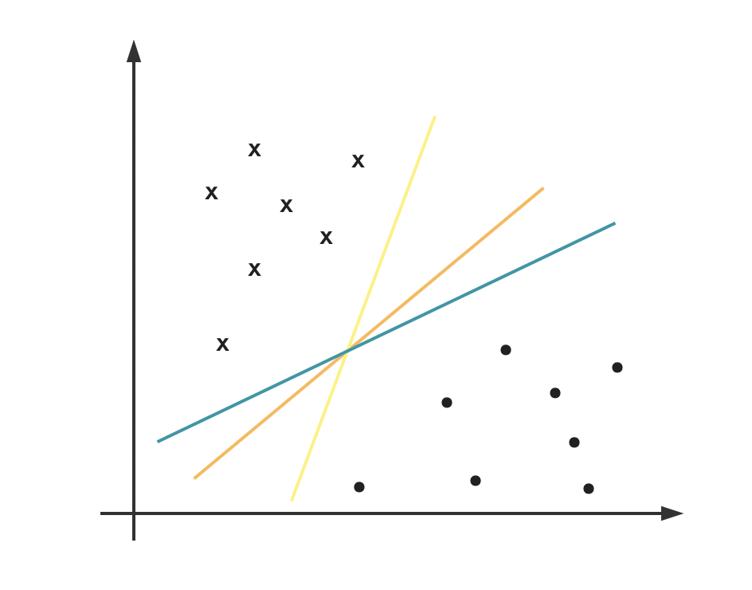
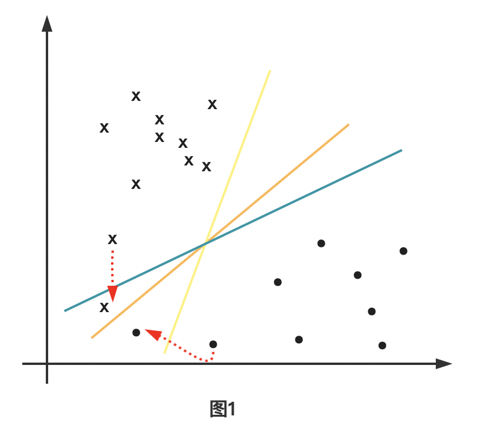
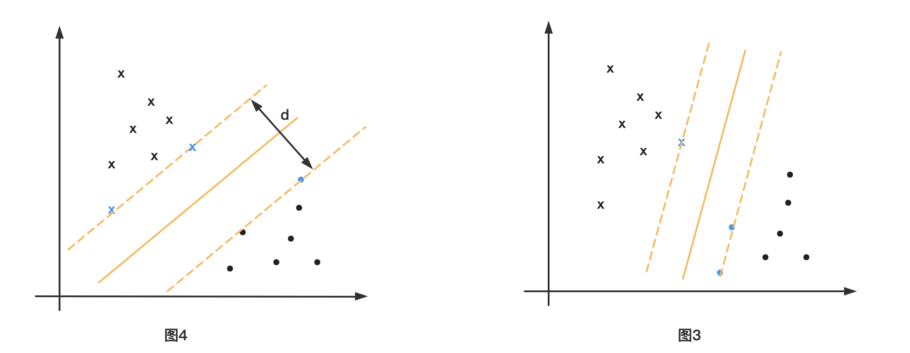
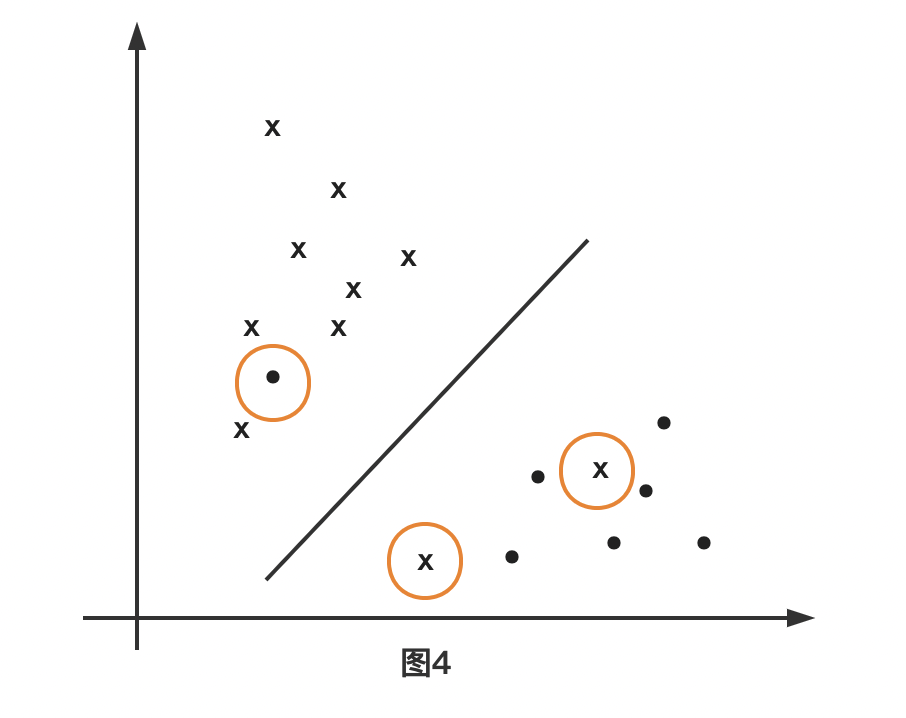

# 第七章 支持向量机

## 1 思考在感知机中无数的解当中最佳的解是哪一个？
在感知机中，因为选取的模型参数初始值不同，以及迭代选取的变量顺序不同所以造成最后的求解超平面并不唯一，也就是结果有可能呈现出下面这样的情况：

当然肯定不止这三条线，实际上可证明在感知机中这样的线应该有无数条。但是以图中3个超平面为例，最佳的超平面是哪一条呢？事实上，很多都会选择橙色的线条，因为如果我们按照图1的红色线条来移动（发生这种情况可能是因为误差），可以发现如果是橙色的超平面，即使发生这样的移动，他们仍然能够被正确分类。

## 2.Vapnik提出的性能指标
事实上vapnik提出了基于支持向量的最大间隔，在图2中来说就是试图平移超平面，直到最先接触到样本，而最终形成了一个平行区域，而中间的平分线就是所需要的超平面。当然这样的区域也有很多，如图3所示

在这里Vapnik等人认为，当区域的间隔最大的时候，其所确定的超平面是最佳的。综上，也就是在一些限制条件下，尽可能的使得d足够的大【有点规划的味道了】。
> 位于区域边界上的样本点事实上就是支持向量，而我们超平面的确定只与支持向量有关，与其余样本没有关系，这也是为什么常说SVM在对小样本进行分类的时候非常有效。
## 3.如何将这种性能指标进行数学描述？
### 3.1 线性可分支持向量机
给定线形可分训练数据集，通过间隔最大化得到分离超平面$$w^*x+b^*=0$$
决策函数为
$$f(x)=sign(wx+b)$$
$w$,$b$为模型的位置参数。要求解这个未知参数就是解相应的凸二次规划问题
$$min\qquad \frac{1}{2}||w||^2$$
$$std\qquad y_i(w^Tx_i+b)\ge1$$
从2.1到这个二次规划问题似乎有些距离，接下来就推导到这个二次规划的
## 3.2 三个事实
**事实1**: $w^Tx+b$和$aw^T+ab$是同一个超平面
**事实2**: 向量$x_0$到超平面$w^T+b=0$的距离公式为$$\frac{|w^Tx_0+b|}{||w||}$$
**事实3**: 对于给定的训练数据集$T$和超平面$w^T+b=0$，定义超平面关于样本点$(x_i,y_i)$的函数间隔为$$r_i=y_i(w*x_i+b)$$

## 3.3 二次规划的推导
在事实2的基础上，知道一点$x_0$到超平面的距离公式为$$\frac{|w^Tx_0+b|}{||w||}$$
同时根据vapnik提出的最大间隔原则，**选择距离超平面最近的一个样本$x_i$使其到超平面的距离最大**，即
$$max\qquad\frac{|w^Tx_i+b|}{||w||}$$
在由事实3，其他的样本到超平面的函数间隔都大于$x_i$到超平面的函数间隔，即
$$y_i(w^Tx_i+b)\ge|w^Tx_i+b|$$
再根据事实3，用a去缩放【超平面不会发生改变】
$$(w,b)\Longrightarrow(aw,ab)$$
最终使在支持向量$x_0$上有$w^Tx_0+b|=1$，这时我们的目标函数和条件就转换为了
$$max\qquad\frac{1}{||w||}$$
$$std\qquad y_i(w^Tx_i+b)\ge1$$
事实上最大化$\frac{1}{||w||}$和最小化$\frac{1}{2}||w||^2$是等价的。所以最终求的了在3.1中的规划模型，即：
$$min\qquad \frac{1}{2}||w||^2$$
$$std\qquad y_i(w^Tx_i+b)\ge1$$
## 3.4 线性可分支持向量机学习算法——最大间隔法
> 输入：线性训练数据集
> 输出：最大间隔分离超平面和分类决策函数
1. 构造并求解约束优化问题：
$$min\qquad \frac{1}{2}||w||^2$$
$$std\qquad y_i(w^Tx_i+b)\ge1$$
并求解最优解$w^*,b^*$
2. 由此得到分离的超平面：
   $$w^* \bullet x + b^* = 0$$
   分类决策函数
   $$f(x)=sign(w^ \bullet x +b)$$
## 3.5 支持向量和间隔边界
在线性可分的情况下，训练数据集的样本点中与分离超平面距离最近的样本点的实例称为支持向量。同时注意到，在我们的图2中，两个间隔边界是平行的，并且没有实例点落在他们的中间。分离超平面与它们平行且位于这条长带的中央。决定分离超平面时只有支持向量起作用，而其他的实例点并没有起作用。如果移动支持向量将改变所求的解；但是如果移动在间隔边界以外的其他实例点，甚至去掉这些实例点，则解是不会改变的。由于支持向量在确定分离超平面中起着决定性的作用，所以将这种分类模型称为支持向量。支持向量的个数一般很少，所以支持向量机由很少的“重要”样本确定。注意【如果数据集不可分这时候线性可分支持向量机就不再合适】

## 4.线性支持向量机
线性可分问题的支持向量机的学习方法，对于不可分训练数据集是不适用的。比如假设训练数据集不是线性可分的。通常情况下，训练数据中存在一些特异点，将这些特异点去掉后，剩下的大部分样本点组成的集合是线性可分的。如图四所示

线性不可分意味着某些样本点$(x_i,y_i)$不能满足函数间隔大于等于1的约束条件。为了解决这个问题，可以对每个样本点$(x_i,y_i)$引进一个松弛变量$\zeta_i \ge 0$